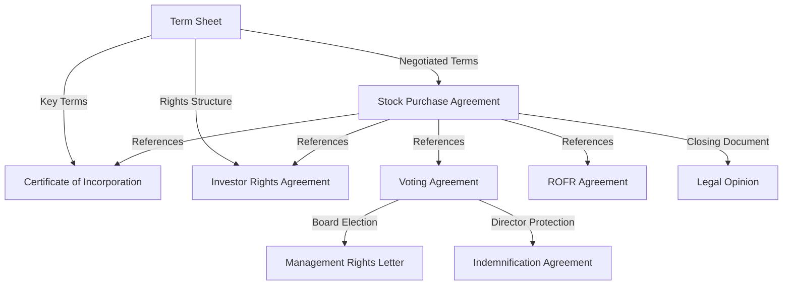

# NVCA Series A Financing Documents

The NVCA Series A document set provides a complete package of legal agreements for preferred stock financing rounds led by institutional venture capital investors. These industry-standard documents reflect decades of market practice and legal refinement.

<Info>
  All NVCA documents are available as free downloads in Microsoft Word format from the NVCA website. Links to official downloads are provided below.
</Info>

## Core Financing Documents

These are the primary documents that form the foundation of a Series A preferred stock financing:

<Accordion title="Series A Term Sheet">
  The term sheet outlines the key economic and control terms of the financing before drafting definitive agreements.
  
  **Key Sections:**
  - Offering terms (price per share, pre/post-money valuation)
  - Liquidation preferences
  - Dividend provisions
  - Voting rights
  - Protective provisions
  - Board composition
  - Anti-dilution protection
  - Registration rights
  
  <Card title="Download Term Sheet" icon="download" href="https://nvca.org/download/5091/">
    Official NVCA Series A Term Sheet (.doc)
  </Card>
  
  <Note>
    Term sheets are typically non-binding except for exclusivity and confidentiality provisions.
  </Note>
</Accordion>

<Accordion title="Stock Purchase Agreement">
  The Stock Purchase Agreement (SPA) is the primary definitive document governing the sale of preferred stock to investors.
  
  **Key Provisions:**
  - Purchase and sale terms
  - Purchase price and closing mechanics
  - Representations and warranties by the company
  - Representations and warranties by founders/key stockholders
  - Conditions to closing
  - Indemnification provisions
  - Investor representations
  
  The SPA typically includes extensive schedules with company disclosure information.
  
  <Card title="Download Stock Purchase Agreement" icon="download" href="https://nvca.org/download/5088/">
    Official NVCA Series A Stock Purchase Agreement (.doc)
  </Card>
  
  <Warning>
    The representations and warranties in the SPA require careful diligence. Material inaccuracies can lead to indemnification claims.
  </Warning>
</Accordion>

<Accordion title="Restated Certificate of Incorporation">
  The Certificate of Incorporation creates the legal rights and preferences of the preferred stock and is filed with the state.
  
  **Key Terms:**
  - Authorized capital stock
  - Preferred stock rights and preferences
  - Liquidation preference (typically 1x, but can be higher)
  - Conversion rights and mechanics
  - Anti-dilution adjustments
  - Voting rights
  - Redemption provisions (if any)
  - Protective provisions
  
  This document amends and restates the company's existing certificate to add the new series of preferred stock.
  
  <Card title="Download Certificate of Incorporation" icon="download" href="https://nvca.org/download/5059/">
    Official NVCA Certificate of Incorporation (.doc)
  </Card>
  
  <Note>
    The Certificate of Incorporation is a public document filed with the Secretary of State.
  </Note>
</Accordion>

<Accordion title="Investor Rights Agreement">
  The Investor Rights Agreement (IRA) governs the ongoing relationship between the company and its investors post-closing.
  
  **Major Rights Granted:**
  
  **Registration Rights:**
  - Demand registration rights
  - Piggyback registration rights
  - S-3 registration rights
  - Registration expenses
  
  **Information Rights:**
  - Annual audited financial statements
  - Quarterly unaudited financial statements
  - Annual budgets and operating plans
  - Inspection rights
  
  **Rights of First Offer:**
  - Right to purchase pro rata share of new securities
  - Exemptions for certain issuances
  
  **Other Provisions:**
  - Termination provisions (typically upon IPO)
  - Assignment rights
  - Confidentiality obligations
  
  <Card title="Download Investor Rights Agreement" icon="download" href="https://nvca.org/download/5066/">
    Official NVCA Series A Investor Rights Agreement (.doc)
  </Card>
</Accordion>

## Governance Documents

These documents establish the governance framework and control mechanisms for the company:

<Accordion title="Voting Agreement">
  The Voting Agreement ensures coordinated voting among founders and investors on key governance matters.
  
  **Key Provisions:**
  - Board composition and election mechanics
  - Drag-along rights (requiring minority holders to join in a sale)
  - Founder vesting provisions
  - Restrictions on founder stock transfers
  - Voting requirements for major decisions
  
  <Card title="Download Voting Agreement" icon="download" href="https://nvca.org/download/5094/">
    Official NVCA Series A Voting Agreement (.doc)
  </Card>
  
  <Info>
    The drag-along provision is critical for ensuring a clean exit process by preventing minority stockholders from blocking an acquisition.
  </Info>
</Accordion>

<Accordion title="Right of First Refusal and Co-Sale Agreement (ROFR)">
  This agreement restricts transfers of company stock and gives investors rights to participate in founder sales.
  
  **Key Rights:**
  
  **Right of First Refusal:**
  - Company has first right to purchase shares
  - Investors have secondary right to purchase
  - Pricing matches third-party offer
  
  **Co-Sale Rights (Tag-Along):**
  - Investors can join in founder sales to third parties
  - Pro rata participation based on holdings
  - Protects investors from being left with minority stake
  
  **Transfer Restrictions:**
  - Limits on stock transfers without company/investor consent
  - Exemptions for permitted transfers (trusts, family members, etc.)
  
  <Card title="Download ROFR Agreement" icon="download" href="https://nvca.org/download/5085/">
    Official NVCA Right of First Refusal and Co-Sale Agreement (.doc)
  </Card>
  
  <Warning>
    Founders should carefully review transfer restrictions as they significantly limit the ability to sell or transfer stock.
  </Warning>
</Accordion>

## Additional Documents

Supplementary documents that support the financing:

<Accordion title="Management Rights Letter">
  A simple letter agreement that grants the investor certain management and information rights, often required for ERISA compliance.
  
  **Purpose:**
  - Satisfies ERISA "venture capital operating company" requirements
  - Grants investor participation rights in management
  - Typically used by VC funds investing pension fund capital
  
  <Card title="Download Management Rights Letter" icon="download" href="https://nvca.org/download/5070/">
    Official NVCA Management Rights Letter (.doc)
  </Card>
  
  <Note>
    This document is often required by institutional VC funds for regulatory compliance purposes.
  </Note>
</Accordion>

<Accordion title="Indemnification Agreement">
  Agreement between the company and its directors/officers providing indemnification protection.
  
  **Coverage:**
  - Defense costs and expenses
  - Judgments and settlements
  - Advancement of expenses
  - Scope and limitations of indemnification
  
  <Card title="Download Indemnification Agreement" icon="download" href="https://nvca.org/download/5063/">
    Official NVCA Indemnification Agreement (.doc)
  </Card>
  
  <Info>
    Indemnification agreements are executed between the company and each director and officer, not just new board members.
  </Info>
</Accordion>

<Accordion title="Model Legal Opinion">
  Template legal opinion letter that company counsel provides to investors at closing.
  
  **Typical Opinions:**
  - Valid existence and good standing of company
  - Authority and authorization to enter into transaction
  - Valid issuance of stock
  - No conflicts with laws or agreements
  - Compliance with securities laws
  
  <Card title="Download Model Legal Opinion" icon="download" href="https://nvca.org/download/5082/">
    Official NVCA Model Legal Opinion (.doc)
  </Card>
  
  <Warning>
    Legal opinions are prepared by experienced corporate counsel and involve significant diligence and legal analysis.
  </Warning>
</Accordion>

## Document Relationships

Understanding how these documents work together:

## Key Terms Explained

<CardGroup cols={2}>
  <Card title="Liquidation Preference" icon="dollar-sign">
    Determines the order and amount investors receive in a sale or liquidation. Typically 1x invested capital before common stock receives anything.
  </Card>
  
  <Card title="Anti-Dilution" icon="shield">
    Protects investors from dilution in down rounds by adjusting their conversion price. Can be "full ratchet" or "weighted average."
  </Card>
  
  <Card title="Protective Provisions" icon="lock">
    Matters requiring investor approval, such as changes to preferred stock rights, sale of company, or issuance of senior securities.
  </Card>
  
  <Card title="Pro Rata Rights" icon="chart-line">
    Investor's right to maintain their ownership percentage by participating in future financing rounds.
  </Card>
  
  <Card title="Drag-Along Rights" icon="users">
    Require minority stockholders to join in a sale approved by the board and majority stockholders, ensuring clean exits.
  </Card>
  
  <Card title="Registration Rights" icon="file-certificate">
    Rights to require the company to register shares for public sale, important for eventual investor liquidity.
  </Card>
</CardGroup>

## Typical Negotiation Points

Common areas of negotiation in Series A financings:

<Accordion title="Valuation and Economics">
  - Pre-money valuation
  - Option pool size and timing
  - Liquidation preference multiple (1x vs. greater)
  - Participation rights (participating vs. non-participating preferred)
  - Dividend rates and accrual
</Accordion>

<Accordion title="Board and Control">
  - Board composition and size
  - Board observer rights
  - Protective provisions scope
  - Voting requirements for major decisions
  - Committee composition
</Accordion>

<Accordion title="Anti-Dilution Protection">
  - Full ratchet vs. weighted average
  - Broad-based vs. narrow-based weighted average
  - Exemptions from anti-dilution adjustment
</Accordion>

<Accordion title="Founder Provisions">
  - Vesting schedules and acceleration
  - Founder lock-up periods
  - Transfer restrictions
  - Representations and warranties scope
</Accordion>

<Accordion title="Investor Rights">
  - Information rights thresholds
  - Pro rata rights minimums
  - Registration rights priority
  - Co-sale and ROFR exemptions
</Accordion>

## Closing Process

Typical steps in closing a Series A financing:

1. **Term Sheet Negotiation**: Negotiate and execute non-binding term sheet
2. **Due Diligence**: Investors conduct legal, financial, and business diligence
3. **Document Drafting**: Attorneys draft definitive agreements based on term sheet
4. **Document Negotiation**: Negotiate specific provisions in definitive documents
5. **Board Approval**: Company board approves financing and documents
6. **Stockholder Approval**: Stockholders approve certificate amendments
7. **Closing Conditions**: Satisfy all conditions to closing
8. **Closing**: Execute all documents, wire funds, issue stock certificates
9. **Post-Closing**: File certificate amendments, update cap table

<Warning>
  Series A closings typically take 4-8 weeks from term sheet execution, depending on diligence and negotiation complexity.
</Warning>

## Comparison with Seed Documents

How NVCA Series A documents differ from seed-stage alternatives:

| Aspect | Seed Docs (Series Seed/YC) | NVCA Series A |
|--------|---------------------------|---------------|
| **Complexity** | Simplified, streamlined | Comprehensive, detailed |
| **Document Count** | 3-5 core documents | 7-9+ documents |
| **Investor Rights** | Basic information rights | Extensive registration, information, and governance rights |
| **Board Control** | Often founder-controlled | Typically investor board seats/control |
| **Protective Provisions** | Limited scope | Extensive list of matters |
| **Legal Costs** | $15k-$40k | $50k-$150k+ |
| **Timeline** | 2-4 weeks | 4-8 weeks |
| **Negotiation** | Relatively standard | Heavily negotiated |

## Working with Counsel

<Info>
  Series A financings require experienced startup and venture capital counsel. The complexity of these documents and the significance of the terms make professional legal advice essential.
</Info>

**What to look for in counsel:**
- Experience with venture capital financings
- Familiarity with NVCA documents
- Understanding of market terms
- Ability to negotiate with investor counsel
- Startup-friendly pricing structures

**Questions to ask your attorney:**
- What are the key terms I should focus on?
- How do these terms compare to market?
- What are the implications of the liquidation preference structure?
- How does the board composition affect control?
- What happens in various exit scenarios?

## Common Pitfalls to Avoid

<Warning>
  These are common mistakes founders make in Series A negotiations:
</Warning>

1. **Not understanding liquidation preferences**: Multiple liquidation preferences and participation rights can significantly reduce founder proceeds in an exit

2. **Agreeing to overly broad protective provisions**: Too many investor veto rights can hamper operational flexibility

3. **Accepting onerous founder vesting**: Ensure vesting schedules account for founder contributions to date

4. **Overlooking option pool timing**: Whether the option pool comes from pre or post-money affects founder dilution

5. **Ignoring drag-along implications**: Understand when you can be forced to sell

6. **Skipping legal counsel**: The cost of experienced counsel is far less than the cost of bad terms

## Resources and Tools

<CardGroup cols={2}>
  <Card title="NVCA Website" icon="globe" href="https://nvca.org/">
    Official NVCA website with resources and updates
  </Card>
  
  <Card title="Model Documents" icon="folder" href="https://nvca.org/resources/model-legal-documents/">
    Download all NVCA model legal documents
  </Card>
  
  <Card title="CooleyGO" icon="book" href="https://www.cooleygo.com/">
    Free startup legal resources and guides
  </Card>
  
  <Card title="Venture Deals" icon="bookmark" href="https://www.feld.com/archives/category/venture-deals">
    Brad Feld's essential book and blog on VC terms
  </Card>
</CardGroup>

## Document Downloads

All NVCA Series A documents are available for free download:

<CardGroup cols={2}>
  <Card title="Term Sheet" icon="file-lines" href="https://nvca.org/download/5091/">
    Series A Term Sheet (.doc)
  </Card>
  
  <Card title="Stock Purchase Agreement" icon="file-contract" href="https://nvca.org/download/5088/">
    Series A Stock Purchase Agreement (.doc)
  </Card>
  
  <Card title="Certificate of Incorporation" icon="file-certificate" href="https://nvca.org/download/5059/">
    Certificate of Incorporation (.doc)
  </Card>
  
  <Card title="Investor Rights Agreement" icon="file-shield" href="https://nvca.org/download/5066/">
    Investor Rights Agreement (.doc)
  </Card>
  
  <Card title="Voting Agreement" icon="file-signature" href="https://nvca.org/download/5094/">
    Voting Agreement (.doc)
  </Card>
  
  <Card title="ROFR Agreement" icon="file-check" href="https://nvca.org/download/5085/">
    Right of First Refusal and Co-Sale Agreement (.doc)
  </Card>
  
  <Card title="Management Rights Letter" icon="file-pen" href="https://nvca.org/download/5070/">
    Management Rights Letter (.doc)
  </Card>
  
  <Card title="Indemnification Agreement" icon="file-circle-check" href="https://nvca.org/download/5063/">
    Indemnification Agreement (.doc)
  </Card>
  
  <Card title="Model Legal Opinion" icon="file-invoice" href="https://nvca.org/download/5082/">
    Model Legal Opinion (.doc)
  </Card>
  
  <Card title="Code of Conduct" icon="handshake" href="https://nvca.org/download/60966/">
    Code of Conduct Policy (.doc)
  </Card>
</CardGroup>

## Next Steps

If you're preparing for a Series A financing:

1. **Review the term sheet** carefully with your advisors
2. **Hire experienced counsel** who understands venture financings
3. **Understand the key terms** and their implications
4. **Run scenarios** to understand outcomes in various exit situations
5. **Negotiate thoughtfully** while maintaining good investor relations
6. **Prepare for diligence** by organizing your corporate records
7. **Plan for post-closing** governance and reporting obligations

<Info>
  A successful Series A financing is not just about raising money—it's about building a partnership with investors who will support your company's growth for years to come.
</Info>

## Related Documentation

- [NVCA Overview](/library/nvca/overview)
- Series Seed Documents (for earlier-stage financings)
- Y Combinator Documents (for angel/seed rounds)
- Incorporation Documents (for entity formation)